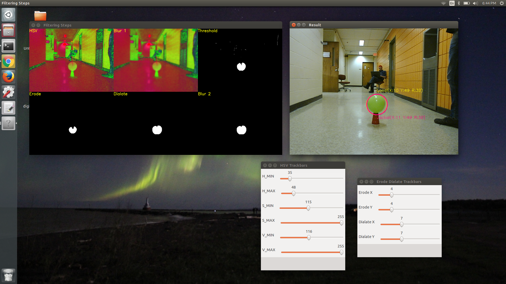

# Good Little Jackal

- Create a launch file to run locally on the Jackal that will bring up the PS3 Eye camera so that it publishes a color image.
- Choose an object that is uniform in color. A bright, non-neutral, color will work best.
- Write a subscriber node that takes in the image from the image publisher above and identifies the object.
 - We are suggestted to use a color thresholding in HSV space.
 - We may use this codePreview the documentView in a new window as a starting point.
 - Other approaches may be attempted if you like.
- Develop a control law for tracking the object via the threshold mask.
- The controller should be to center the object within the camera's field of view.
- The controller should attempt remain the same approximate distance from the object.
- Same in this case refers to the size relative to the size at the start of the control loop.
- Your controller must include a hysteresis/thresholding element ensuring that visual feedback results in smooth movement/tracking of the object.
- Upon pressing the "circle" button on the PS4 controller the should begin tracking your object.
- Tracking should stop when the "X" button is pressed.

## Local Development

After cloning this repository, follow these steps to setup the development environment
```
$ cd lab_6_ws
$ catkin_make
$ source devel/setup.bash
$ source remote-jackal.sh jackal4
```

Now, ssh onto Jackal-4 and start the utilites on the Jackal

```
$ git pull
$ cd good-jackal/lab_6_ws
$ source devel/setup.bash
$ roslaunch good_jackal jackal.launch
```

## Calibration

Color calibration can be done using the calibration scripts that have been made. On the jackal, run the following commands

```
$ git pull
$ cd good-jackal/lab_6_ws
$ source devel/setup.bash
$ roslaunch good_jackal jackal.launch
```

Back on your development laptop, run these sequence of commands to launch the calibration tools

```
$ git pull
$ cd good-jackal/lab_6_ws
$ source devel/setup.bash
$ rosrun good_jackal calibration.py
```

Should see something like this to show you all the configuration parameters.


The yellow circle is the local configuration believes is the ball, the pink circle is what the jackal's configuration believes is the ball. Using this, you can compare your configuration before and after and see potential improvement.

## Launch File Descriptions

Name|Description
:---|:---:
[jackal](lab_6_ws/src/good_jackal/launch/jackal.launch)|Self contained launch file that will launch all the sensors, their drivers or supporting nodes. This doesn't include any nodes that will cause the robot to move, simply creates a platform to conduct higher order functions. This is intended to be launched on the Jackal.
[follow](lab_6_ws/src/good_jackal/launch/follow.launch)|This launch file launchs the ball tracking and following nodes on the local machine. Traditionally, this is your remote development laptop.
[all_jackal](lab_6_ws/src/good_jackal/launch/all_jackal.launch)|This launch file launchs the ball tracking and following nodes and is intended to be ran on the Jackal itself.
